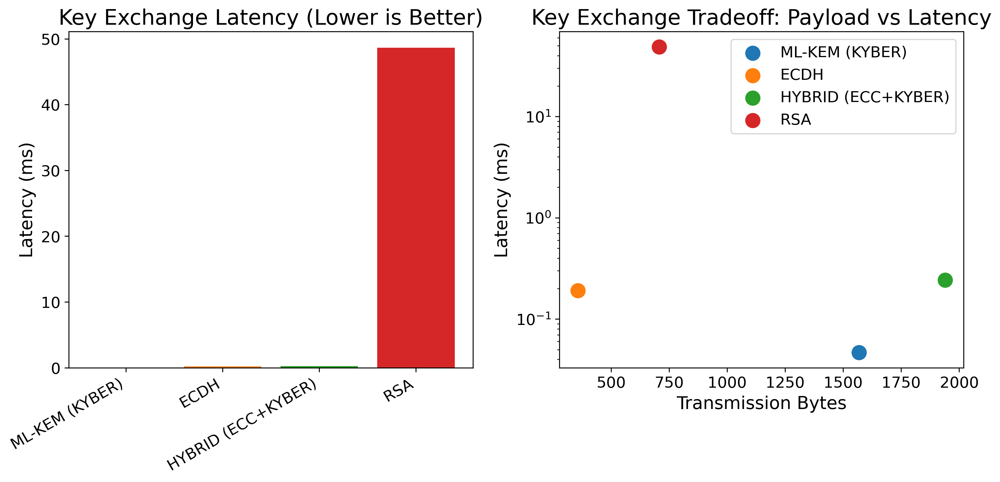
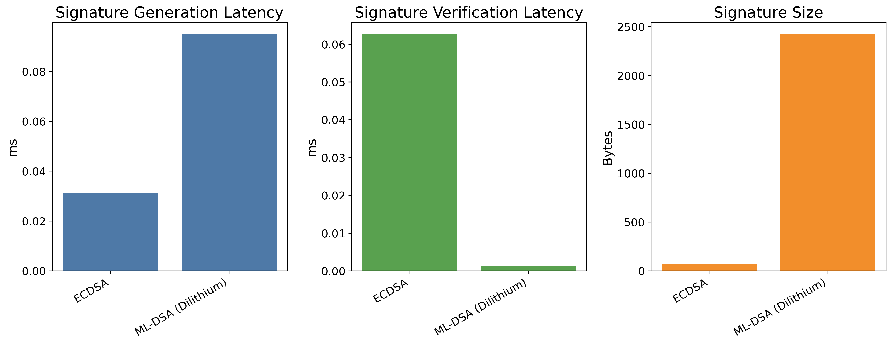
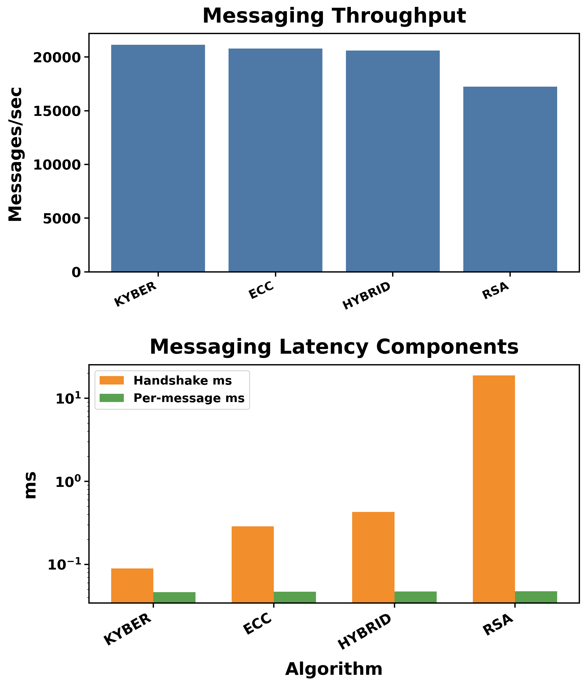
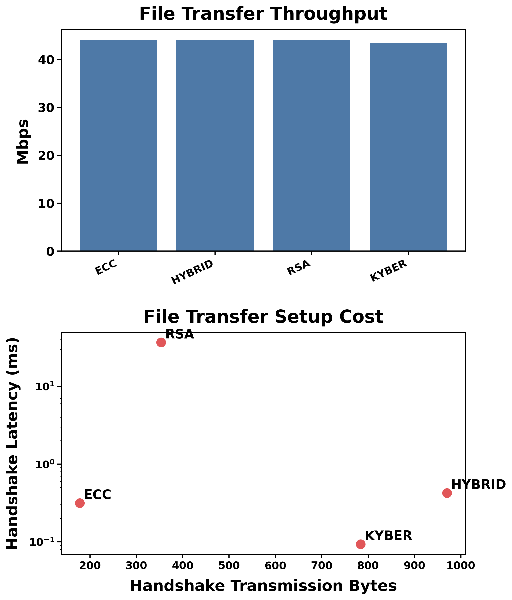
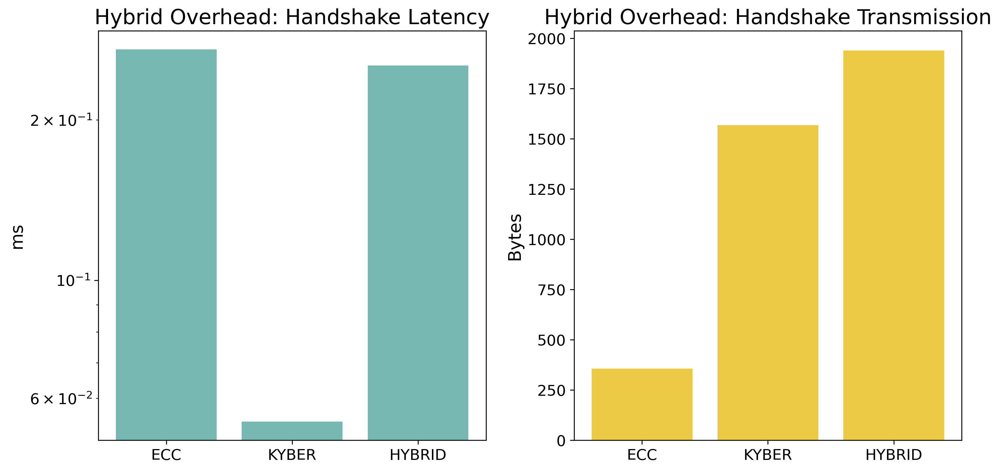

# Introduction

## The Quantum Threat

Public-key cryptography is one of the quiet assumptions behind almost every modern system. Transport Layer Security (TLS) handshakes, software updates, identity infrastructure, cloud application programming interfaces (APIs), and secure messaging all rely on hardness assumptions behind the Rivest-Shamir-Adleman public-key cryptosystem (RSA) and elliptic-curve cryptography (ECC). If cryptographically relevant quantum computers become practical, that assumption changes. Shor’s algorithm would make the core asymmetric primitives behind RSA and ECC computationally insecure, which means confidentiality and authenticity guarantees built on those primitives would fail [@shor1994].

The practical concern is not only "the day quantum arrives." It is also the *harvest now, decrypt later* model: encrypted traffic collected today can be stored and decrypted in the future once capable quantum hardware exists. That risk is especially relevant for long-lived secrets (health records, legal records, financial history, and government data), where confidentiality requirements outlast current key lifetimes. Broad surveys of quantum-safe migration consistently identify this timing gap as a primary systems risk [@pqc_survey_comprehensive; @pqc_review_eprint].
In real terms, this risk affects everyday systems people use for banking, healthcare, messaging, and identity login. A quantum-capable attacker would most likely first target long-lived encrypted archives and legacy identity/signature paths: decrypting old captured traffic, impersonating trusted services, or forging signatures on software and documents. At the same time, the migration itself has practical cost because post-quantum and hybrid artifacts are larger, which can increase handshake traffic, stress edge/mobile links, and make setup slower on constrained devices. So the engineering challenge is two-sided: move too slowly and long-term privacy/trust erodes; move too abruptly and operational overhead can hurt real user experience.

## Why RSA/ECC Fail

RSA depends on the hardness of factoring large integers, while ECC depends on the hardness of the elliptic curve discrete logarithm problem. On classical hardware, both are hard at current key sizes. On large enough quantum hardware, they are not. In other words, the issue is not that RSA and ECC are currently “broken,” but that their *security margin is not future-proof* under the quantum threat model.

This creates an engineering problem, not just a mathematical one. Systems cannot simply “swap algorithms” overnight. Public keys, signatures, handshake flows, certificate handling, and wire formats are all tied to protocol and implementation details. The migration path must therefore address both cryptographic correctness and operational reality.

A practical timeline estimate is uncertain, but current literature suggests teams should plan for migration well before a full break is possible. Mosca’s risk framing argues that if the data shelf-life plus migration time exceeds the time to quantum break, organizations are already late [@mosca2018]. Resource estimates for factoring RSA-2048 also indicate that very large, fault-tolerant quantum systems would be required, which are not available today but remain an active long-term target [@gidney2021].

For engineering planning, this thesis uses three practical windows:

- **Near-term window (now):** inventory cryptography, identify long-lived sensitive data, and add crypto-agility interfaces.
- **Mid-term window (next deployment cycles):** deploy hybrid handshakes in high-value channels and monitor operational overhead.
- **Long-term window (standards maturity):** move to post-quantum defaults where interoperability and tooling are stable.

This is not a claim that RSA/ECC fail tomorrow. It is a claim that waiting for a precise "break date" is a poor systems strategy.

## Research Goals

This thesis focuses on a systems-level question:

> How can NIST-selected post-quantum primitives be integrated into real application workflows while keeping performance and deployment risk manageable?

The project has three goals:

1. **Measure practical overhead** of classical, post-quantum, and hybrid choices using repeatable benchmarks.
2. **Evaluate integration behavior** in workload-like scenarios (messaging sessions and file-transfer sessions), not only microbenchmarks.
3. **Propose a migration strategy** that is implementable in staged enterprise environments.

## Reader Guide and Core Terms

Because this thesis includes cryptography and systems language, this short guide defines the most frequent terms in plain language:

- **Handshake:** the setup phase where two endpoints agree on secrets before sending application data.
- **Key exchange / KEM:** method to derive a shared secret between endpoints; in this thesis, RSA/ECDH/ML-KEM variants are compared.
- **Signature:** cryptographic proof that data came from the claimed sender and was not modified.
- **Latency (ms):** elapsed time for an operation; lower is generally better.
- **Throughput (messages/s or Mbps):** amount of useful work completed per second; higher is generally better.
- **Transmission bytes:** amount of data carried by cryptographic setup artifacts (keys/ciphertexts/signatures).
- **Hybrid mode:** combining a classical and a post-quantum secret in one handshake so security does not rely on only one assumption.

In short: this thesis does not only ask "Which algorithm is faster?" It asks, "Where does cost appear, how much does it matter in real workflows, and what migration sequence is operationally safe?"

### Motivation and What I Learned

I chose this topic after exploring current technology problems that felt both important and genuinely interesting to me. I wanted something that blended math and computer science, and post-quantum cryptography stood out because it has both deep theory and real-world urgency. A conversation I had with someone else who was also interested in PQC helped push me toward focusing this thesis on practical migration, not just cryptographic concepts.

The biggest thing I learned is that PQC has many strong advantages, but adoption is not as simple as picking a new algorithm and replacing the old one. Prioritizing migration now is important, especially for long-lived sensitive data, but the transition has to be engineered carefully around system constraints. In practice, the hardest parts are often where overhead shows up (handshake latency, payload size, protocol compatibility, and operations), and this project taught me that successful migration depends on measured tradeoffs, phased rollout, and crypto-agile design choices.

# Cryptographic Background

## Classical

Classical public-key cryptography in this project is represented by RSA and ECC:

- **RSA** is used as a familiar baseline with broad legacy deployment.
- **ECC** (Elliptic Curve Diffie-Hellman (ECDH) for key agreement and Elliptic Curve Digital Signature Algorithm (ECDSA) for signatures) is used as the modern classical baseline due to better performance and smaller key/signature sizes than RSA in many deployments.

These baselines are useful because migration decisions are comparative. Teams rarely deploy PQC into an empty system; they replace or layer over existing RSA/ECC-based designs.

## Lattice Cryptography Explanation

Lattice-based cryptography provides one of the strongest current candidates for quantum-resistant public-key systems. In simplified terms, lattice problems are built around high-dimensional geometric grids where finding a hidden short vector is computationally difficult. A useful intuition is that an attacker sees many valid-looking vectors, but only a few are “unusually short” in a way that reveals secret structure; identifying those efficiently in high dimensions is the hard part.

An analogy: imagine being dropped into a city with millions of nearly identical streets, then being asked to find one tiny shortcut path with noisy map coordinates. In 2D this may be manageable; in hundreds of dimensions with noise, it becomes computationally hard.

This connects to two foundational hard problems:

- **Shortest Vector Problem (SVP):** find the shortest non-zero vector in a lattice.
- **Closest Vector Problem (CVP):** given a target point, find the nearest lattice vector.

Modern lattice schemes do not require solving these exactly during normal operation, but their security confidence is linked to the assumed hardness of related approximate versions [@pqc_survey_comprehensive; @pqc_review_eprint].

This work evaluates two NIST-standardized lattice families:

- **ML-KEM (FIPS 203)** for key establishment [@fips203].
- **ML-DSA (FIPS 204)** for digital signatures [@fips204].

## LWE Intuition

Learning With Errors (LWE) can be explained intuitively as follows: you see many linear equations, but each equation has a small random noise term added. Without noise, solving the system is straightforward. With noise, recovering the hidden structure becomes hard in high dimensions. Much of modern lattice cryptography leverages this "structured equations + controlled error" model to build encryption and key establishment schemes.

The key idea for systems engineers is simple: LWE-based constructions buy quantum resistance at the cost of larger objects (public keys, ciphertexts, signatures) and sometimes higher computational overhead. This thesis measures those tradeoffs in concrete workloads, consistent with broader literature on implementation complexity and deployment constraints [@pqc_embedded_complexity].

# PQC Standards

## ML-KEM (FIPS 203)

ML-KEM is used as the post-quantum key establishment primitive in this project. In implementation terms, it is integrated through a key encapsulation mechanism (KEM) interface and evaluated against RSA- and ECDH-style key exchange behavior in both microbenchmarks and session-oriented workloads.

Operationally, ML-KEM has a clean three-step flow:

1. **Key generation:** receiver creates a public key and private key.
2. **Encapsulation:** sender uses the receiver public key to produce (a) ciphertext and (b) a shared secret.
3. **Decapsulation:** receiver uses the private key and ciphertext to recover the same shared secret.

Why this matters in practice: the protocol gets a shared key without directly transporting that key in plaintext form, and this maps cleanly to handshake state machines.

In systems terms, the main tradeoff observed in this work is low computation latency but larger transmitted artifacts.

In this framework, ML-KEM generally shows very low handshake latency but higher transmitted bytes compared with ECDH.

## ML-DSA (FIPS 204)

ML-DSA is used as the post-quantum signature primitive and compared directly with ECDSA. The benchmark design separately measures sign latency, verify latency, and signature size.

At a high level, ML-DSA signs by sampling structured randomness and producing a lattice-based response that the verifier checks using the public key. From an engineering perspective:

- signing is the producer-side cost,
- verification is the consumer-side cost,
- signature bytes are the transport and storage cost.

This decomposition is important because many real systems verify more often than they sign (for example, software update distribution, artifact verification pipelines, and distributed service authentication). Signature-size growth remains an integration cost that impacts storage, bandwidth, and certificate-chain design.

The measured pattern is consistent with expected tradeoffs: ML-DSA verification is very fast, while signature sizes are substantially larger than ECDSA.

# System Design

## Framework Architecture

The implementation is organized into three layers:

1. **Crypto layer** (`crypto/`): RSA, ECC, ML-KEM, ML-DSA, and hybrid KEX support through a common interchangeable interface.
2. **Benchmark layer** (`benchmarks/`): repeatable measurement scripts for key exchange, signatures, and refined cross-workload experiments.
3. **Workload layer** (`workloads/`): TLS-like handshake simulation, secure messaging sessions, and secure file-transfer sessions.

This separation made it possible to test algorithm substitutions without rewriting workload logic, which is a practical model for crypto-agile system design.

The three-layer split was intentional. The crypto layer isolates primitive correctness and interchangeability, the benchmark layer provides controlled and repeatable measurement, and the workload layer captures end-to-end behavior seen by real systems. Keeping these concerns separate reduced experimental confounders and made debugging much faster when a regression appeared in only one layer.

Why this directly answers the advisor question about "three layers":

- Without a separate **crypto layer**, algorithm changes risk rewriting application logic.
- Without a separate **benchmark layer**, performance observations are hard to reproduce and compare.
- Without a separate **workload layer**, results may be mathematically interesting but operationally misleading.

In other words, the architecture itself is part of the thesis contribution, not just implementation detail.

## Workload Model

Two workload classes were used to move beyond isolated microbenchmarks:

- **Messaging sessions:** repeated encrypted message processing under configurable session reuse.
- **File transfer:** chunked transfer pipeline with optional renegotiation points.

The workloads report latency components, throughput, transmission bytes, and memory behavior, so overhead can be localized (setup vs steady state).

The two microbenchmark families (key exchange and signatures) were chosen because they represent the dominant asymmetric operations in deployment: session establishment and authenticity verification. If migration cost is acceptable in these two paths, organizations can reason about most of the practical asymmetric risk surface before addressing secondary protocol features. This design also aligns with recent heterogeneous-environment and industry benchmarking studies that focus on KEM/signature behavior as first-order deployment signals [@pqc_heterogeneous_benchmark; @pqc_industry_performance].

The project also includes an implemented **hybrid key exchange mode** (`HYBRID (ECC+KYBER)`) that derives session key material from both classical (ECC) and post-quantum (KYBER) shared secrets. Hybridization is also discussed in broader cross-technology security literature (including PQC+QKD combinations), which supports staged transition models rather than abrupt single-step replacement [@hybrid_nist_qkd].

## Experimental Methodology

The methodology combines:

- **Microbenchmarks:** key exchange latency/CPU/size, signature sign/verify/size.
- **Application-oriented runs:** messaging and file-transfer metrics under repeated sessions.
- **Raw + summary exports:** all benchmark scripts export machine-readable CSV artifacts for later plotting and interpretation.

Plots and initial findings are generated from the benchmark outputs through a reproducible analysis pipeline (`analysis/plots.py`), with figure export in PNG/PDF/SVG for publication workflows.

The motivation for using all three methodology types was to answer different engineering questions:

- **Microbenchmarks** isolate primitive-level cost (How expensive is this cryptographic operation itself?).
- **Application-oriented runs** reveal amortization and bottlenecks under realistic traffic patterns (Does this setup cost still matter once work scales?).
- **Raw + summary exports** ensure reproducibility and auditability (Can another person reproduce and verify these claims?).

Together, they prevent overfitting conclusions to a single metric view.

This is the explicit rationale for the two chosen microbenchmark families:

- **Key exchange microbenchmark:** answers setup-path questions (latency + handshake bytes).
- **Signature microbenchmark:** answers authenticity-path questions (sign/verify asymmetry + signature-size impact).

These are the two asymmetric operations that most directly affect migration risk in production systems.

# Benchmark Results

## Graphs

The strongest comparison figures produced in this work are:

- `key_exchange_tradeoff` (latency vs transmission size)
- `signature_comparison` (sign, verify, size)
- `messaging_system_view` (throughput and latency components)
- `file_transfer_comparison` (throughput and setup cost)
- `hybrid_overhead` (hybrid-specific latency and bytes)

These figures were selected because they show not only which primitive is faster, but *where* each design imposes cost.

{width=95%}

{width=95%}

{width=95%}

{width=95%}

{width=95%}

## Comparisons

The refined experiments produce concrete, repeatable tradeoffs [@pqc_heterogeneous_benchmark; @pqc_industry_performance]:

- **Key exchange latency:**
  - ECDH mean: **0.1906 ms**
  - ML-KEM mean: **0.0468 ms** (**0.25x** ECDH latency)
  - Hybrid mean: **0.2430 ms** (**1.27x** ECDH latency)
  - RSA mean: **48.6581 ms** (**255.3x** ECDH latency)
- **Key exchange transmission bytes:**
  - ECDH: **356 B**
  - ML-KEM: **1568 B** (**+340.4%** vs ECDH)
  - Hybrid: **1940 B** (**+444.9%** vs ECDH)
  - RSA: **707 B** (**+98.6%** vs ECDH)
- **Signatures:**
  - ML-DSA verification is **46.9x faster** than ECDSA verification.
  - ML-DSA signing is **3.0x slower** than ECDSA signing.
  - ML-DSA signatures are **34.1x larger** than ECDSA signatures.
- **Messaging throughput (with session reuse):**
  - RSA: **17,243.9 msgs/s**
  - ECC: **20,790.7 msgs/s**
  - KYBER: **21,137.0 msgs/s**
  - Hybrid: **20,605.1 msgs/s**

These outcomes reinforce that algorithm choice should be tied to workload and risk profile, not one-dimensional speed rankings.

## Analysis

Three experiment-derived conclusions are central:

1. **Setup overhead and payload growth are the main migration costs.**
2. **Steady-state throughput remains competitive when setup is amortized.**
3. **Hybrid deployment is operationally useful as a transition strategy.**

### Unique Findings Derived from This Thesis Data

The following findings are not generic PQC statements; they come directly from the measured data in this project:

1. **Handshake-share collapse in messaging sessions:**
  - RSA handshake contributes **38.69%** of session latency.
  - ECC handshake contributes **0.60%** of session latency.
  - KYBER handshake contributes **0.19%** of session latency.
  - Hybrid handshake contributes **0.88%** of session latency.

  Interpretation: once sessions are reused, post-quantum setup overhead becomes a small part of end-to-end messaging latency.

2. **Throughput-size decoupling in file transfer:**
  - Throughput spread across all algorithms is only **0.606 Mbps**.
  - Hybrid throughput is only **0.10% lower** than ECC despite larger handshake bytes.

  Interpretation: for transfer-heavy workloads, setup-byte inflation does not automatically imply large throughput collapse.

3. **Verification-dominant advantage for ML-DSA:**
  - Verification is **46.9x faster** than ECDSA, while signing is slower.

  Interpretation: ML-DSA is especially attractive in architectures where verification volume dominates signing volume.

For engineering teams, this means migration should prioritize protocol paths where long-term confidentiality matters most and where handshake overhead can be amortized.

# Integration Challenges

## Bandwidth Inflation

Post-quantum and hybrid schemes increase key and ciphertext/signature sizes. This affects handshake packets, storage of key material, and transport-level behavior in constrained links. In practical terms, the cost is often acceptable in data center environments but can be significant in edge or mobile contexts, especially under embedded resource limits [@pqc_embedded_complexity].

In real systems, "larger cryptographic artifacts" create visible operational costs:

- **More bytes per handshake:** increased setup traffic can reduce responsiveness on mobile networks and high-latency links.
- **Higher infrastructure load:** API gateways, load balancers, and TLS terminators process more data per new connection.
- **More retries under poor connectivity:** larger setup packets are more sensitive to packet loss and radio instability.
- **Battery and device impact:** mobile and embedded devices spend more energy on transmit/receive and parsing.

An intuitive analogy: if classical handshakes are like sending a short postcard, many PQ/hybrid handshakes are like sending a padded envelope. One envelope is fine, but millions per day change logistics, cost, and latency behavior.

## Key Storage

Larger public keys and signatures alter key-management assumptions. Certificate chains, trust stores, and cache layers must be validated for size growth. Operationally, this can require updates to limits, schemas, and telemetry thresholds rather than only cryptographic code changes.

## Protocol Redesign

Some protocol paths assume specific key formats or message sizes. Integrating PQC therefore requires interface updates, handshake message redesign, and explicit negotiation strategy (classical, PQ, hybrid). The project’s crypto-agile abstractions were useful for isolating these changes.

## Hardware and Deployment Friction (What Hardware Is Affected?)

The main hardware pressure points are:

- **CPU front-end and cache behavior:** larger keys/ciphertexts/signatures increase memory movement and cache pressure.
- **Network interface and edge links:** larger handshake payloads increase setup traffic, especially visible on constrained or high-latency links.
- **Embedded/IoT-class devices:** small memory budgets and lower clock rates amplify PQ overhead.
- **Load balancers and TLS terminators:** high-rate handshake environments may require hardware acceleration or capacity planning updates.

# Migration Framework

## The Proposed Roadmap

Based on the implementation and measured behavior, a practical roadmap is:

### Phase 0: Baseline and Inventory
- Map where RSA/ECC are currently used (TLS, signing, artifact validation, key stores).
- Record baseline metrics (handshake latency, setup bytes, throughput, peak memory).
- Define acceptance budgets per system.

**Gate to Phase 1:** baseline telemetry is complete and reproducible.

### Phase 1: Crypto-Agility Refactor
- Introduce explicit algorithm selection at interface boundaries.
- Keep protocol/business logic separate from primitive implementations.
- Add integration tests for classical, PQ, and hybrid modes.

**Gate to Phase 2:** algorithm swaps can be performed without application-level rewrites.

### Phase 2: Targeted Hybrid Deployment
- Enable hybrid in channels with long confidentiality horizon and manageable rollback risk.
- Use canary deployments to quantify handshake-byte and setup-latency effects.
- Track failure domains (certificate handling, handshake negotiation, parser limits).

**Gate to Phase 3:** operational error rates and latency budgets remain within limits.

### Phase 3: PQ-Preferred Rollout
- Move selected services from hybrid-first to PQ-preferred where ecosystem support is stable.
- Retain fallback logic during transition windows.
- Update key/certificate lifecycle processes for larger artifacts.

**Gate to Phase 4:** PQ-preferred paths are stable in production and interoperability goals are met.

### Phase 4: Governance and Continuous Validation
- Enforce crypto policy in continuous integration/continuous delivery (CI/CD) checks.
- Re-benchmark periodically as libraries, compilers, and hardware evolve.
- Maintain incident playbooks for cryptographic rollback and emergency rotation.

This phased model reduces migration risk while preserving forward security goals.

## Outcomes Promised

The paper promises three things: benchmarking, protocol integration, and migration strategy. This thesis delivers those three outcomes with direct evidence:

1. **Benchmarking:** reproducible microbenchmark and workload metrics across classical, PQ, and hybrid configurations.
2. **Protocol Integration:** implemented crypto-agile layering and a functioning hybrid handshake path (ECC+KYBER).
3. **Migration Strategy:** phased roadmap with measurable gates informed by observed latency, byte-growth, throughput, and memory behavior.

# Discussion & Future Work

This project demonstrates that PQ migration is feasible with disciplined measurement and interface-driven design, but it also has limits. Current results are tied to this framework, parameter settings, and host environment. Broader external validity requires repeated runs across network conditions, hardware classes, and protocol stacks.

Future work includes:

- adding larger-scale statistical runs and confidence intervals,
- extending workload diversity (e.g., API gateways, service meshes, IoT constraints),
- integrating certificate-path and public key infrastructure (PKI) lifecycle analysis,
- and evaluating additional standardized or emerging primitives where relevant.

Hardware acceleration is also an important future direction, because dedicated lattice accelerators may reduce performance penalties in constrained or high-throughput deployments [@lattice_accelerators_pq_era].

The broader takeaway is practical: the quantum transition should be treated as a systems engineering program, not only a cryptographic substitution task.

# Acknowledgements

I would like to thank my Honors Thesis advisor, Dr. Joseph Kirtland, for his continuous support on this project, from explaining the core mathematical theory to helping me shape and refine the paper direction.

# References
